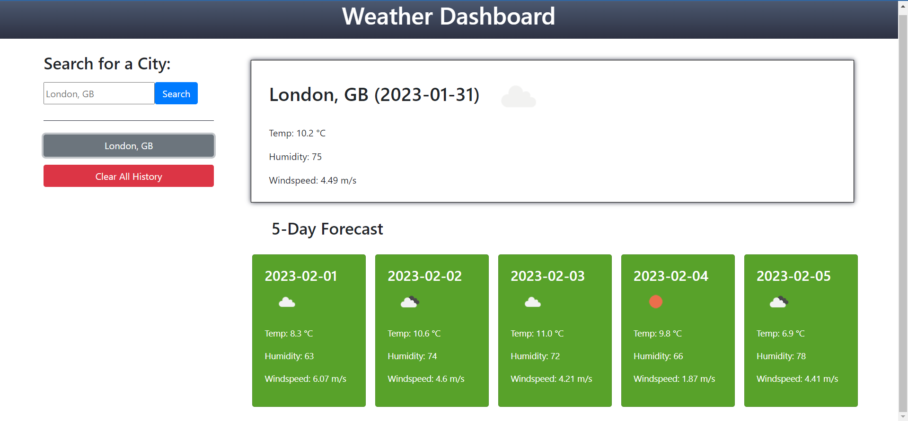

# 5_Day-Weather_Forecast Application

## Description

This project provides an application that displays weather data - including temperature, humidity and windspeed - for a chosen city on the current day and consecutive five days. 

The application provides further functionality in saving the history of previously-searched cities in easily-accessible history buttons, which can be cleared at user request, and an autocomplete function for different cities with the same name. 

The application can be accessed here: https://yusen22.github.io/5_Day_Weather_Application/

A screenshot of the application can be viewed here: 

## Table of Contents

- [Installation](#installation)
- [Usage](#usage)
- [Credits](#credits)
- [License](#license)

## Installation

N/A 

## Usage

To begin using the application, start typing the name of a chosen city into the search box in the top-left of the application. As the input is entered, a number of autocomplete list items will appear under the search box, displaying the typed city name exactly with an additional country code. Select the desired option with regard to the country in which the chosen city resides by clicking on it. Then, click 'Submit' to search weather data for that location.  

The weather data for that location - namely the temperature (in Celsius), humidity (in relative %), windspeed (in m/s), and an icon representing weather - will then be displayed within the application. The weather data for the current day, along with the date, are shown in the large card to the right of the page. The green cards underneath this element also display weather data for the five consecutive days following the current date.

NOTE: The weather data for each day is for the time of 12:00:00.

Additionally, searching for and selecting a city, and then choosing to display it's weather data, will create a 'history' button for that city that persists when revisiting the page. This will be diplayed to the left of the application, underneath the search input. To access data from previously-searched cities, click the button with the chosen city name, and the weather forecast will be displayed.

To clear all historic search values, click the red 'Clear All History' button underneath the displayed history buttons. A prompt will then appear confirming this choice. Click 'OK' to confirm and remove all previous searches, or 'Cancel' to revert to the application with no change applied. 

NOTE: A maximum of 9 historic search entries can be stored and displayed within the application.

## Credits

N/A 

## License

Please refer to the LICENSE in the repo. 

---